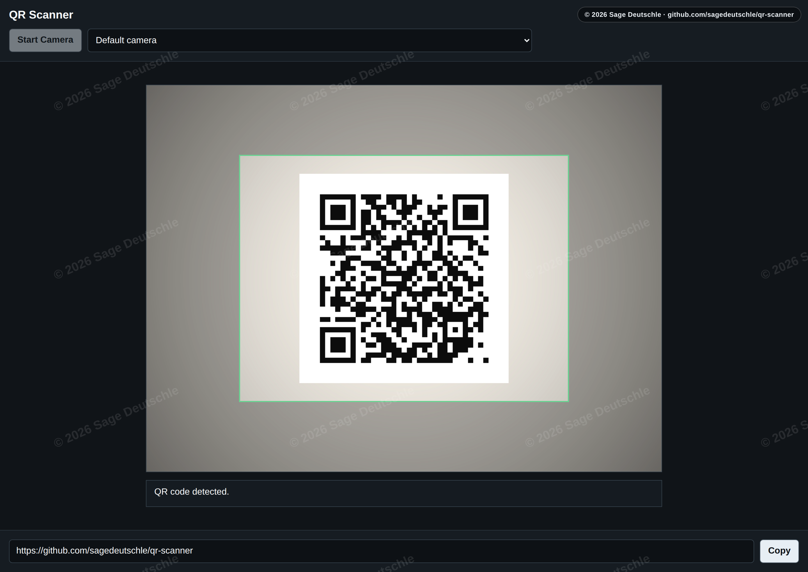
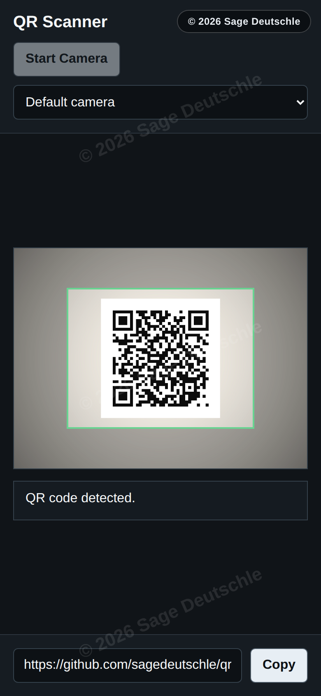

# QR Scanner

> Just stuff I thought would be useful for the things I want to do. If you think they will be useful for you too feel free to use them as well, just PLEASE dont try and sell it, helpful code should be for everyone. If you use this as a part of another free program credit would be nice smile :).

A tiny browser-based QR code scanner. One HTML file, one bundled JS library, no
backend, no build step, no dependencies to install.

[](./LICENSE)
[](./index.html)
[](./index.html)

[**▶ Try the live demo**](https://sagedeutschle.github.io/qr-scanner/)

[](https://sagedeutschle.github.io/qr-scanner/)

## Features

- **Scans straight from your camera** — point it at a QR code and the decoded
  text lands in a copy-friendly field.
- **Native-first decoding** — uses the browser's built-in
  [`BarcodeDetector`](https://developer.mozilla.org/en-US/docs/Web/API/BarcodeDetector)
  API when available (Chromium, recent Safari), so scanning is fast and
  battery-friendly.
- **Works everywhere else too** — falls back to
  [jsQR](https://github.com/cozmo/jsQR) (vendored as `jsQR.min.js`) on browsers
  without `BarcodeDetector`.
- **Camera picker** — a dropdown selects between multiple cameras, handy on
  laptops with several webcams or phones with front/back lenses.
- **Responsive** — the same file works on desktop and phones, and long camera
  device names can't break the layout.
- **Private by design** — nothing ever leaves your device. No network requests,
  no analytics, no backend. It even works offline.

<p align="center">
  
</p>

## Use it locally

Open `index.html` in a modern browser. That's it — `file://` is a secure context,
so the camera API works without a server.

If you'd rather serve it (e.g. from a phone on the same Wi-Fi), use HTTPS or
`localhost` — browsers refuse camera access from plain HTTP on a LAN IP.

```sh
# from inside the repo
python3 -m http.server 8000
# then open http://localhost:8000 on the same machine
```

## How it works

- Uses the native [`BarcodeDetector`](https://developer.mozilla.org/en-US/docs/Web/API/BarcodeDetector)
  API when available (Chromium, recent Safari).
- Falls back to [jsQR](https://github.com/cozmo/jsQR) (vendored as `jsQR.min.js`)
  on browsers that don't have `BarcodeDetector`.
- Picks the camera via a dropdown — handy on machines with multiple cameras.
- Detected text lands in a copy-friendly input field.

## License

MIT — see [LICENSE](./LICENSE). Attribution is required by the license (keep the
copyright notice), and a friendly credit is always appreciated.

Screenshots and preview images are © 2026 Sage Deutschle.
